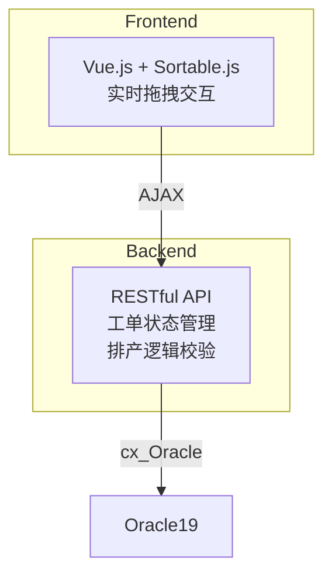
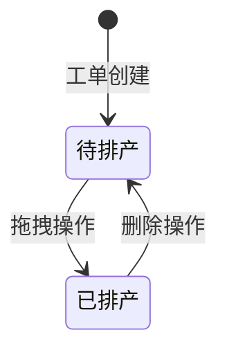

# 生产排产系统文档

## 业务逻辑
这是一个flask框架的生产排产的功能。将待排产的工单通过拖拽的方式排入未来的6个班次中。

页面结构：
平分左右两半部分。
左半部分是待排产的生产工单列表，每个工单包含工单号、所需工时、最早生产日期等信息。
右半部分是是一个类似表格的结构，表格第一列是未来三天三个日期，第二列是未来三天的6个班次，每天分为A、B这2个班次，每个班次12小时，A班早上8：00到晚上20：00，B班晚上20：00到次日8：00。第三列是时间段，从第一天的8：00开始到第三天的20：00，每一行为半个小时时间跨度。第四列展示对应6个班次已排入的工单。具体结构可以参考static下的排产模板2.xlsx。

初始化：
左侧工单池内显示所有待排产（工单计划状态=0）的工单（按照最早生产日期升序动态排序），
“SELECT a.SCGDH,
                        a.GSXS,
                        a.ZZSCRQ,
                        a.ZZSCSJ,
                        a.JHRQ,
                        a.JHSJ,
                        b.KHMC,
                        b.PH     PH,
                        b.gg     GG,
                        b.JHZS   SL
                    FROM uf_SCGDWH a
                    left join A_PC_DPCSCGD_VW b
                        on a.scgdh = b.SCGDH
                    WHERE a.GDJHZT = 0
                    ORDER BY a.ZZSCRQ, a.ZZSCSJ“


右侧的每个班次信息显示已经排入的工单（工单计划状态=0）。并且按照计划开始时间和结束时间，对应相应的时间刻度（高度跨越列数=工单工时/0.5）

动态拖拽排产与取消排产：
工单池中的工单被拖入右边对应时间段上，展示为以该时间段为开始时间，向下扩展高度的单元格数=工时/0.5 的一段合并单元格。可以参考static下的排产模板2.xlsx中的工单0001和0002。
之后系统将数据库中该条工单的工单计划状态改为1，将排入的日期和班次分别写入BC、PCRQ字段。开始时间写入JHKSSJ，结束时间写入JHJSSJ字段。已排产工单有一个删除按钮，删除之后，工单也从班次中回到工单池，相应的数据库里也将排产状态改为0，并清空BC、PCRQ、JHKSSJ、JHJSSJ字段。

注意：如果工单被排入最早生产日期之前的日期和时间段，系统报警提示，用户确认后可以排入。如果工单排产后的结束时间晚于交货日期和交货时间，系统报警提示，用户确认后可以排入
写入日期格式为“2025-06-09”，时间格式为“9：30”，数据库的日期和时间全部为字符串格式，不需要转换日期格式。
数据库是Oracle19，表 uf_SCGDWH。uf_SCGDWH表结构：SCGDH：生产工单号；GDJHZT：工单计划状态，0为待排产，排产完成后需要修改状态为1；JHRQ：交货日期；JHSJ：交货时间；ZZSCRQ：最早生产日期；ZZSCSJ：最早生产时间；GSXS：所需工时。PCRQ：排产日期；BC：班次；JHKSSJ：计划开始时间；JHJSSJ：计划结束时间。


项目结构：
/production_scheduling
│── app.py                # Flask主应用
│── models.py             # 数据模型和数据库操作
│── config.py             # 数据库配置
│── requirements.txt      # 依赖包
│── static/
│   │── style.css         # 样式表
│   │── sortable.js       # 拖拽库
│── templates/
│   │── index.html        # 主页面


### 1. 核心功能
- 工单池动态排序（按最早生产日期）
- 可视化班次工时统计（总工时/剩余工时）
- 跨班次拖拽排产（支持工单回收）
- 排产合法性校验（最早生产日期/交货日期）

### 2. 技术架构


### 3. API接口说明
#### 3.1 排产接口
```
POST /assign_order
请求参数：{"order_no": "SC202406001", "plan_date": "2024-06-10", "shift": "A"}

响应格式：
- 成功：{"success": true}
- 冲突：{"success": false, "message": "..."}
- 警告：{"success": "warning", "message": "..."}
```

### 4. 安装指南
```bash
# 创建虚拟环境
python -m venv .venv

# 安装依赖
pip install -r requirements.txt

# 数据库配置（修改config.py）
DB_HOST=192.168.0.100
DB_SERVICE=ORCL
DB_USER=*******
DB_PASSWORD=******
```

### 5. 待补充信息
<!-- 请在此区域补充以下内容 -->
- [ ] 压力测试报告：不需要压力测试，小型嵌入式应用，几乎不存在并发场景。
- [ ] 前端异常处理流程
- [ ] 数据库备份策略：另有系统外数据库备份，暂不考虑。
- [ ] 权限控制方案：暂不考虑。

## 技术实现

### 6. 关键算法
**班次容量计算**：
```python
def calculate_remaining_hours(scheduled_orders):
    total = sum(order['gsxs'] for order in scheduled_orders)
    return max(12 - total, 0)
```

### 7. 测试策略
| 测试类型 | 工具 | 覆盖率目标 |
|---------|------|------------|
| API测试 | pytest | 90%+       |
| E2E测试 | Cypress | 核心流程覆盖 |
| 负载测试 | Locust | 500并发    |

### 8. 安全注意事项
1. 数据库连接池大小限制（当前配置：10连接）
2. 输入参数SQL注入防护（使用参数化查询）
3. 日期格式严格校验（YYYY-MM-DD）

## 数据库规范

### 9. 排产状态流转


### 10. 性能优化
- 工单池缓存机制（Redis待接入）
- 班次数据预加载（每日00:00刷新）
- 批量状态更新接口（待开发）

